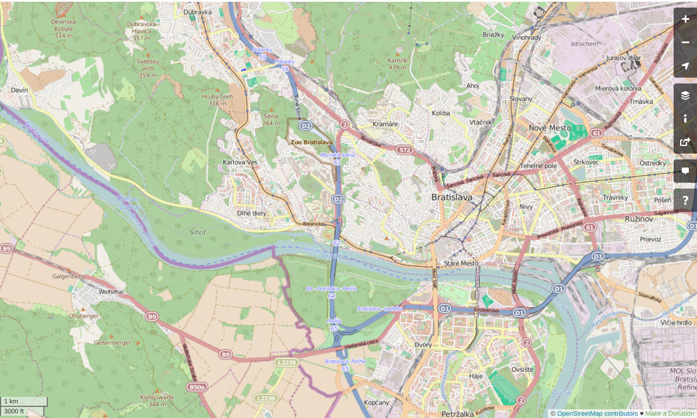

# Lab 3 - PostGIS

Grading: 3pt

## Setup

Download the docker container as usual

````
docker run -p 5432:5432 fiitpdt/postgis
````

You can safely ignore errors about extension being already present and there are some
constraint validation failures, but don't worry about them.

| Attribute| Value                  |
|----------|------------------------|
| Login    | postgres               |
| Database | gis                    |
| Password | none, leave blank      |
| Spatial reference system | WGS 84 |

Inside the database, you'll find Open Street Map data for a large portion of
Bratislava. More precisely, this extent:



## SQL tricks you might find useful

### Cross joins

You'll be using cross joins (cartesian joins) a lot, because often, there is
no column to join on. The regular join syntax requires an `ON` clausule, so
something like the following is a syntax error:
````
SELECT * FROM planet_osm_line l
  JOIN planet_osm_polygon p 
 WHERE p.name = 'Karlova Ves'
````
Instead, you need to do
````
SELECT * FROM planet_osm_line l 
 CROSS JOIN planet_osm_polygon p
 WHERE p.name = 'Karlova Ves'
````

### `WITH` clausule

When you need to use a subselect, the query can often get very hairy and
unreadable. Alternatively, you can first set up all subqueries and then just
reference them, e.g.:

````
WITH leisure AS (
  SELECT * FROM planet_osm_polygon p
  WHERE leisure IS NOT NULL
)
SELECT SUM(st_area(way)) FROM leisure
````

## Labs

Write queries to answer the following questions:

1. How far (air distance) is FMFI UK from the Bratislava main train station?
   The query should output the distance in meters without any further
   modification.

   *Hint: notice the difference between geometry and geography types in this
   case.*

2. Which other districts are direct neighbours with
   'Karlova Ves'?

3. Which bridges cross over the Danube river?

4. Find the names of all streets in 'Dlhé diely' district.

5. Experiment with `ST_DISTANCE` and `ST_DWITHIN` predicates and find what distinguishes them.

  *Hint: EXPLAIN ANALYZE*

Optional:

6. What percentage of area of 'Dlhé diely' is available for leisure? (such as
   parks, tennis courts, etc.)

7. In which restaurants can you enjoy a view of the Danube river? Let's say
   that the air distance must be less than 300 meters.

  *Hint: The Danube river is composed of multiple lines and polygons*

## Recommended reading

- [PostGIS in Action](https://www.manning.com/books/postgis-in-action-third-edition)
- [List of OSM tags](https://wiki.openstreetmap.org/wiki/Category:Tag_descriptions)
